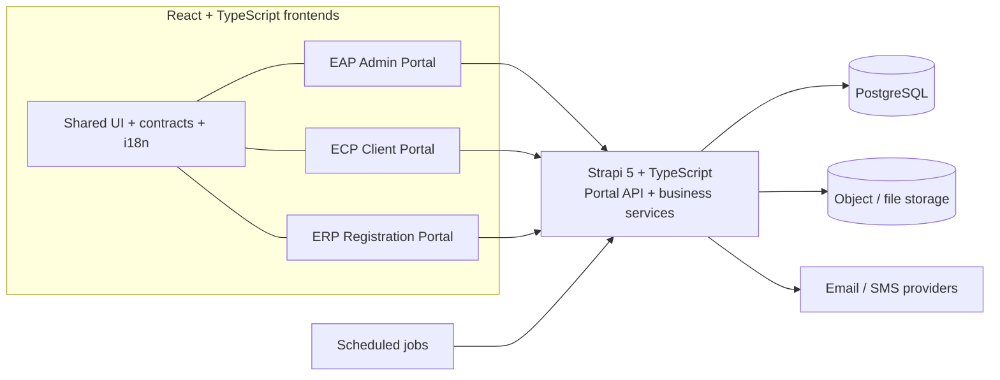
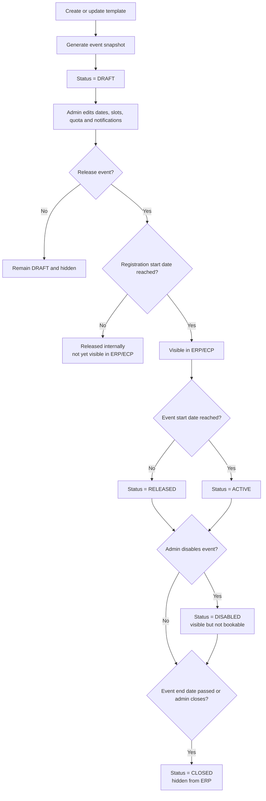
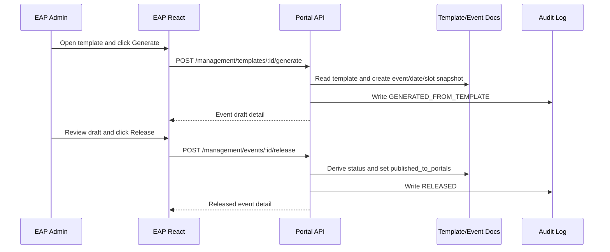
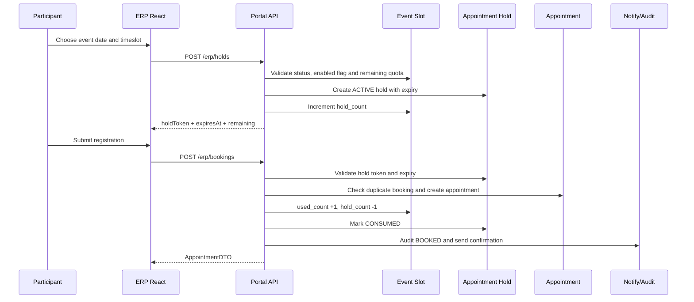
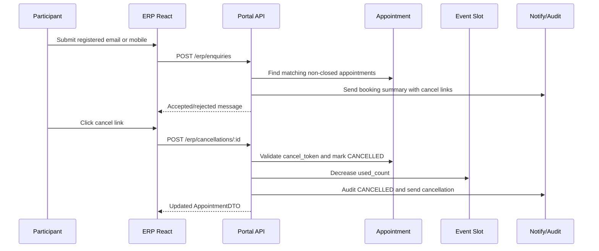

# Flu Vaccination Portal — Updated Technical Specification

**Version:** 1.1  
**Architecture baseline:** ReactJS + TypeScript frontends, Strapi 5 + TypeScript backend  
**Scope of update:** align the technical spec to the React frontend / Strapi backend split and add flow charts plus API sequence diagrams.

## 1. Purpose of this revision

This revision updates the earlier technical-spec draft so it can serve as the implementation baseline for three React-based portals — EAP, ECP and ERP — backed by a single Strapi 5 TypeScript service layer. It also makes the main workflows explicit through flow charts and sequence diagrams.

### 1.1 Decision summary

| Topic | Selected option | Why |
| --- | --- | --- |
| Frontend architecture | Three ReactJS + TypeScript portals: EAP, ECP, ERP | Each portal is independently deployable and communicates with the same backend. |
| Backend architecture | One Strapi 5 + TypeScript backend | Strapi is the system of record and owns content types, workflow services, scheduling jobs and file/media integration. |
| Tenancy model | Partition + group + portal-user | Partitions control public event scope, groups control internal portal access, portal users inherit access from groups. |
| Publishing model | Template -> event snapshot -> release -> public visibility by registration window | Templates stay reusable; generated events are mutable snapshots. |
| Booking model | Hold-based slot reservation before booking confirmation | Prevents oversubscription and matches the requirement for quota-on-hold. |
| Duplicate policy | One active booking per participant per event | Reschedule is done by cancel + rebook. |
| Cancellation model | History-preserving cancel, not hard delete | Capacity is released immediately and audit history is retained. |
| Notification model | Per-event, per-channel, per-language templates | Confirmation, reminder and cancellation messages are configurable. |

### 1.2 System boundary

- **EAP** is the authenticated admin portal for QHMS users.
- **ECP** is the authenticated client HR portal scoped by user group and partition.
- **ERP** is the public participant portal entered by QR code or partition URL.
- **Strapi 5** is the backend system of record and owns schemas, business workflows, notifications and scheduled jobs.

## 2. Architecture overview

The frontends should not bind themselves to raw Strapi entities. They consume portal-oriented DTOs from custom `/api/portal/*` routes so that Strapi internals can change without forcing portal rewrites.

### 2.1 System component flow chart

### 2.2 Frontend route structure

| Portal | Core routes | Purpose |
| --- | --- | --- |
| EAP | /dashboard, /partitions, /groups, /users, /templates, /events, /appointments, /content, /contact | Authenticated admin portal for QHMS users. |
| ECP | /login, /events, /events/:documentId, /documents, /contact, /reset-password | Authenticated client HR portal scoped by group and partition. |
| ERP | /p/:partitionCode, /p/:partitionCode/events/:documentId, /enquiry, /documents, /contact | Public bilingual registration portal entered via QR code or URL. |

## 3. Access control and tenancy

### 3.1 Core model

1. **User Partition** is the public scope for ERP QR codes and URLs. Multiple events may share the same partition.
2. **User Group** determines which internal portal the user can access and which partitions/events are visible to that group.
3. **Portal User** is an internal authenticated user linked to a group and a portal role.

### 3.2 Access rules

- QHMS groups grant access to **EAP**.
- Non-QHMS groups grant access to a client-specific **ECP**.
- Users without an internal group do not log in; they reach **ERP** via QR code or public URL.
- ERP event visibility is partition-based and excludes `CLOSED` events.
- ECP visibility is group/partition-based and excludes events outside the user company scope.

## 4. Strapi 5 schema design

### 4.1 Content-type inventory

#### Access and tenancy content types

| Content type | Purpose | Key fields | Notes |
| --- | --- | --- | --- |
| user-partition | Public partition / event scope | code, description, slug, status | Linked to groups, templates, events, documents and contacts. |
| user-group | Portal access group | code, company_code, portal_type, status | Links internal users to one or more partitions. |
| portal-user | Internal portal user profile | full_name, email, portal_role, status, last_login_at | Belongs to a user-group and optionally maps to auth user. |

#### Form and event design content types

| Content type | Purpose | Key fields | Notes |
| --- | --- | --- | --- |
| mandatory-field | Mandatory registration field library | key, field_type, labels, validation_json, required | Managed in Strapi, locked in EAP, and always available to ERP templates. |
| event-template | Reusable event blueprint | name, company_name, event_name, default dates, slot duration, quota, registration dates | Stores bilingual content and form_fields component snapshot. |
| event | Generated event snapshot | status, published_to_portals, event dates, registration dates, quota_per_slot, reminder_offset_days | Release target for ECP and ERP. |
| event-date | One generated date row under event | event_date, enabled, sort_order | Parent of event-slot. |
| event-slot | One timeslot row under event-date | start_time, end_time, quota, used_count, hold_count, enabled | Real-time remaining = quota - used_count - hold_count. |

#### Booking and audit content types

| Content type | Purpose | Key fields | Notes |
| --- | --- | --- | --- |
| appointment-hold | Temporary ERP capacity reservation | hold_token, expires_at, status | Created on slot selection and consumed or expired later. |
| appointment | Confirmed or cancelled booking | booking_reference, participant fields, communication_preference, cancel_token, status | Stores participant snapshot and slot snapshot for reporting. |
| audit-log | Operational history | action, actor_email, actor_role, entity_type, details | Tracks generate, release, book and cancel actions. |

#### Portal content delivery types and components

| Content type | Purpose | Key fields | Notes |
| --- | --- | --- | --- |
| portal-document | Portal download item | title_en, title_zh, portal_targets, file, user_partition | Visible to one or more portals with optional partition scope. |
| contact-info | Portal contact card/content | title_en, title_zh, phone, email, portal_targets, user_partition | Visible to one or more portals with optional partition scope. |
| form.field-config | Reusable form field snapshot component | field_key, field_type, labels, required, visibility | Used inside event-template and event. |
| notification.template-message | Notification template component | template_type, channel, language, subject, body, enabled | Used by event for confirmation, reminder and cancellation. |

### 4.2 Data ownership rule

Strapi owns all persisted business entities: partitions, groups, portal users, custom field library, event templates, generated events, event dates, event slots, appointment holds, appointments, portal documents, contacts and audit logs.

## 5. Domain model and lifecycle

### 5.1 Event design model

- **Custom Field**: reusable field library entry.
- **Event Template**: reusable blueprint with default dates, quotas, bilingual content and form field configuration.
- **Event**: generated snapshot copied from the template and then edited independently.
- **Event Date / Event Slot**: generated schedule rows under the event.
- **Appointment Hold**: temporary ERP reservation to prevent overbooking.
- **Appointment**: confirmed or cancelled participant booking record.

### 5.2 Event lifecycle flow chart

### 5.3 Scheduling and quota rules

- Event slots are generated from `event_start_date`, `event_end_date`, `day_start_time`, `day_end_time` and `timeslot_duration_minutes`.
- Each slot has its own `quota`, `used_count` and `hold_count`.
- `remaining = quota - used_count - hold_count`.
- Disabled dates or disabled slots are hidden from ERP and ECP.

## 6. API design and endpoint catalog

### 6.1 API design principles

- Portal UIs consume typed DTOs instead of raw Strapi entities.
- EAP and ECP routes are authenticated in production even if the scaffold temporarily marks them open.
- ERP routes are public but must be rate-limited and token-protected where applicable.
- Portal APIs are organized by audience: `eap`, `ecp`, `erp`, and `management`.

### 6.2 Management endpoints

| Method | Path | Used by | Purpose | Request | Response |
| --- | --- | --- | --- | --- | --- |
| POST | /api/portal/management/templates/:documentId/generate | EAP | Generate event snapshot from template | actorEmail | EventDetailDTO |
| POST | /api/portal/management/events/:documentId/release | EAP | Derive status and publish state | actorEmail | EventDetailDTO |
| POST | /api/portal/management/appointments/:documentId/cancel | EAP / ECP | Cancel appointment and release capacity | actorEmail, actorRole, reason | AppointmentDTO |

### 6.3 ECP endpoints

| Method | Path | Used by | Purpose | Request | Response |
| --- | --- | --- | --- | --- | --- |
| GET | /api/portal/ecp/dashboard?companyCode=HSBC | ECP | Client dashboard stats | - | DashboardDTO |
| GET | /api/portal/ecp/events?companyCode=HSBC | ECP | Visible events for client | - | EventListItemDTO[] |
| GET | /api/portal/ecp/events/:documentId?companyCode=HSBC | ECP | Event detail with slots and fields | - | EventDetailDTO |
| GET | /api/portal/ecp/documents?companyCode=HSBC | ECP | Client-scoped documents | - | PortalDocumentDTO[] |
| GET | /api/portal/ecp/contacts?companyCode=HSBC | ECP | Client-scoped contacts | - | ContactInfoDTO[] |

### 6.4 ERP endpoints

| Method | Path | Used by | Purpose | Request | Response |
| --- | --- | --- | --- | --- | --- |
| GET | /api/portal/erp/partitions/:partitionCode | ERP | Public landing page by partition | - | PartitionLandingDTO |
| GET | /api/portal/erp/events/:documentId | ERP | Public event detail | - | EventDetailDTO |
| POST | /api/portal/erp/holds | ERP | Create temporary hold | CreateHoldInput | HoldResponseDTO |
| POST | /api/portal/erp/bookings | ERP | Submit registration | CreateBookingInput | AppointmentDTO |
| POST | /api/portal/erp/enquiries | ERP | Send booking summary by email/SMS | EnquiryInput | EnquiryResponseDTO |
| POST | /api/portal/erp/cancellations/:documentId | ERP | Cancel booking by secure token | reason, cancelToken | AppointmentDTO |
| GET | /api/portal/erp/documents | ERP | Portal documents | - | PortalDocumentDTO[] |
| GET | /api/portal/erp/contacts | ERP | Portal contacts | - | ContactInfoDTO[] |

## 7. API sequence diagrams

### 7.1 Generate event from template and release

### 7.2 ERP booking with hold-based quota control

### 7.3 ERP enquiry and cancellation

## 8. Scheduled jobs

| Schedule | Job | Effect |
| --- | --- | --- |
| Every minute | Expire active holds | Marks expired holds and decrements hold_count. |
| Every minute | Sync event statuses | Moves events between RELEASED, ACTIVE and CLOSED based on date rules. |
| Hourly | Send reminders | Sends reminder messages when appointment_date - reminder_offset_days = today. |

## 9. Security, operations and non-functional requirements

| Area | Requirement |
| --- | --- |
| Security | JWT or SSO for EAP/ECP, portal-level policies in Strapi, cancel-token validation for ERP cancellation links, and rate limiting for public ERP endpoints. |
| Concurrency | Booking and hold creation must be transaction-safe. Production deployment should use database transactions or row locking around slot counters. |
| Time zone | Store timestamps in UTC and render business dates/times in Asia/Hong_Kong. |
| Auditability | Every generate, release, booking and cancellation action writes an audit-log entry. |
| Internationalization | All end-user content and templates support English and Chinese. |
| Observability | Log API errors, notification failures, cron outcomes and booking-validation failures for operations support. |

## 10. Resolved requirement ambiguities

| Topic | Resolution |
| --- | --- |
| Public event URL | QR code and public URL resolve to ERP partition landing page, not to an authenticated ECP page. |
| Released vs visible | Release prepares the event for publication; actual ERP/ECP visibility starts when registration_start_date is reached. |
| Duplicate submission | The system rejects a second active booking for the same participant identity within the same event. |
| Password handling | The requirement says email a new password; the production design uses secure invite/reset links instead. |
| Deletion behavior | Appointments are cancelled rather than hard-deleted. Event and template deletion should be soft-delete or protected by integrity checks. |
| Template updates | Templates are reusable sources; generated events are snapshots and are not retroactively rewritten. |

## 11. Implementation notes for the generated monorepo

- The business-facing architecture is **React frontend + Strapi backend**.
- A generated codebase may still use **Next.js** as the React runtime/framework wrapper without changing this specification.
- Shared packages should contain DTO contracts, UI primitives and bilingual dictionaries.
- The Strapi admin console should be restricted to technical administrators; business operations should happen through EAP.

## 12. Recommended next step

Use this document as the implementation baseline for:

1. production-grade Strapi policies and authentication
2. real notification-provider integration
3. transaction-safe booking logic
4. Excel export, QR asset generation and document upload hardening
