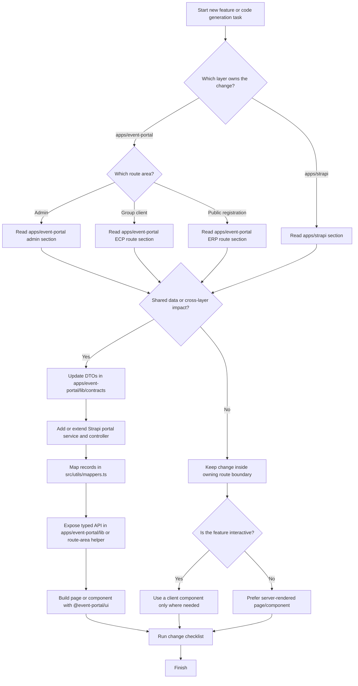

# Code Generation Guidelines

This document defines how generated code should fit into the Event Portal monorepo.

Use it when creating new pages, API wrappers, Strapi portal endpoints, DTOs, or workflow code.

## Scope

Apps in this repo:

- `apps/event-portal` - unified Next.js frontend for EAP admin routes, ECP group routes, and ERP public routes
- `apps/strapi` - Strapi backend and workflow layer

Shared frontend modules:

- `apps/event-portal/lib/contracts` - DTOs, fixtures, and type contracts
- `apps/event-portal/lib/ui` - UI primitives used by the EAP/ECP/ERP frontend

## How To Use This Guide

1. Identify which runtime layer owns the feature.
2. Inside `apps/event-portal`, identify which route area owns the change.
3. Apply the shared rules first.
4. Follow the section for the owning route area or backend layer.
5. If the change crosses frontend and backend layers, follow the preferred generation workflow near the end of this document.

### Usage Flow Chart

## Shared Rules

### Architecture

- Keep the admin, client HR, and public participant route areas conceptually separate even though they now live in one frontend app.
- Treat `apps/event-portal/lib/contracts` as the source of truth for shared DTO shapes.
- Frontends should consume portal-oriented responses, not raw Strapi entity payloads.
- Prefer extending existing portal endpoints under `/api/portal/*` before introducing new ad hoc frontend data paths.

### TypeScript and data flow

- Preserve strict typing end to end.
- Add or update DTOs in `apps/event-portal/lib/contracts/index.ts` before wiring new cross-app data.
- Keep fallback fixture behavior when an app already uses it in `lib/api.ts`.
- Do not duplicate DTO types inside app folders if the type belongs in shared contracts.

### Frontend conventions

- For Next.js apps, default to server components.
- Add `'use client'` only for interactive flows such as timers, form state, or browser-only behavior.
- Keep page files focused on composition and data loading.
- Put app-specific layout wrappers in `components/*-shell.tsx`.
- Put app-specific fetch wrappers in `lib/api.ts`.
- Reuse `@event-portal/ui` primitives before adding one-off layout components.

### Backend conventions

- Keep Strapi controllers thin. They should read params, call services, and assign `ctx.body`.
- Put business logic in Strapi services.
- Put record-to-DTO translation in `apps/strapi/src/utils/mappers.ts`.
- Keep workflow helpers in focused utility files such as `booking.ts`, `slot-capacity.ts`, `schedule.ts`, and `event-status.ts`.
- For write operations, preserve auditability and quota integrity.

### Style

- Follow the existing simple, explicit coding style.
- Prefer small helpers over deep abstraction.
- Match existing naming:
  - Next apps: `getDashboard`, `getEvents`, `getEventDetail`
  - Strapi mappers: `mapEventListItem`, `mapAppointment`
  - Strapi visibility helpers: `eventVisibleInEcp`, `eventVisibleInErp`
- Keep comments rare and only where the flow is not obvious from the code itself.

## Frontend Route Areas

### `apps/event-portal` admin routes

Purpose: admin routes for partitions, groups, templates, events, appointments, documents, and support content.

### Generate code like this

- Build new screens as App Router pages under `apps/event-portal/app/**/page.tsx`.
- Wrap pages with `EapShell`.
- Load page data through `apps/event-portal/lib/api.ts`.
- Use `Promise.all` when a page needs multiple independent datasets.
- Prefer shared presentation components from `@event-portal/ui` such as `Card`, `SimpleTable`, `StatGrid`, `SplitGrid`, and `StatusBadge`.

### Keep these boundaries

- EAP owns admin and management features.
- EAP may trigger management mutations such as event generation, release, or appointment cancellation through portal endpoints.
- Do not place low-level Strapi document logic in EAP page code.
- Do not bypass shared DTOs with custom untyped response parsing in page components.

### File placement

- `app/*` - route entrypoints
- `app/ecp/*` and `app/p/*` are separate route areas and should not be mixed into admin pages unless the feature is explicitly admin-facing
- `components/eap-shell.tsx` - portal shell wrapper
- `lib/api.ts` - typed CMS access and fallbacks
- `lib/nav.ts` - left navigation items

### When extending EAP

- If the UI needs a new read model, add the Strapi portal service response first, then expose it through `lib/api.ts`.
- If the UI needs a new action, add a portal mutation endpoint instead of posting directly to raw collection APIs.
- Preserve bilingual labels where the surrounding admin UI already uses them.

### `apps/event-portal` ECP route area

Purpose: client HR routes for group-scoped event visibility, participant visibility, documents, and support content.

### Generate code like this

- Build group-scoped screens under `apps/event-portal/app/ecp/[groupCode]/**/page.tsx`.
- Wrap pages with `EcpShell`.
- Keep group scoping explicit in data fetches by using `groupCode`.
- Route all app data access through the dedicated ECP helpers in `apps/event-portal/lib/ecp-api.ts`.
- Render event and appointment data using shared DTOs from `@event-portal/contracts`.

### Keep these boundaries

- This route area is visibility-focused, not admin-master-data-focused.
- It should only expose data within the current group and linked partition scope.
- Do not add admin-only management features such as partition or template maintenance here.
- Avoid unscoped queries. If a feature is group-filtered, the query parameter and backend filtering must both exist.

### File placement

- `app/ecp/[groupCode]/*` - group-scoped route entrypoints
- `components/ecp-shell.tsx` - portal shell wrapper
- `lib/ecp-api.ts` - typed portal fetchers with `groupCode`
- `lib/ecp-nav.ts` - client route navigation

### When extending ECP

- Add server-side group filtering in Strapi first, then mirror that input in `lib/ecp-api.ts`.
- Keep ERP links and appointment views read-oriented unless a business rule explicitly allows an action such as cancellation.
- Preserve the group-based route pattern using `/ecp/{groupCode}`.

### `apps/event-portal` ERP route area

Purpose: public registration routes for partition landing, event discovery, booking, enquiry, and public cancellation flows.

### Generate code like this

- Keep public entry routes under `apps/event-portal/app/p/[partitionCode]/**`.
- Wrap pages with `ErpShell`.
- Keep landing and detail pages server-rendered where possible.
- Isolate booking or enquiry interactivity in client components such as `apps/event-portal/components/booking-form.tsx`.
- Use typed helper functions in `apps/event-portal/lib/erp-api.ts` for landing, detail, hold, booking, and enquiry calls.

### Keep these boundaries

- This route area is partition-based and public.
- It should never own admin setup logic.
- Public UI may guide the user through holds and bookings, but backend validation remains authoritative.
- Do not rely on client state alone for slot correctness, booking uniqueness, or hold validity.

### File placement

- `app/p/[partitionCode]/*` - public partition routes
- `components/erp-shell.tsx` - portal shell wrapper
- `components/booking-form.tsx` - interactive booking flow
- `components/enquiry-form.tsx` - public enquiry flow
- `lib/erp-api.ts` - typed portal fetchers and mutations

### When extending ERP

- Keep hold lifecycle messaging explicit: selected slot, expiry time, countdown, and submission state.
- Preserve graceful fallbacks already present in `lib/api.ts` for local development without a live backend.
- Only add `'use client'` where a route truly needs browser state or event handlers.

### `apps/strapi`

Purpose: backend schemas, portal-oriented read models, and booking workflow orchestration.

### Generate code like this

- Define content structure in `src/api/*/content-types/*/schema.json`.
- Keep controller files under `src/api/*/controllers/*.ts`.
- Keep business logic in `src/api/*/services/*.ts`.
- Expose portal-facing read and write operations from `src/api/portal/services/portal.ts`.
- Convert Strapi records to frontend DTOs through `src/utils/mappers.ts`.

### Keep these boundaries

- Strapi owns persistence, workflow rules, and DTO assembly.
- Controllers should not hold business rules.
- Portal services should return stable DTOs that match `apps/event-portal/lib/contracts`.
- Do not leak raw Strapi response shapes to the frontend when a mapper-backed DTO exists.

### Required patterns for new backend work

- Use `strapi.documents(...).findMany`, `findOne`, `create`, and `update` consistently with populated relations as needed.
- For mutations that affect booking lifecycle, preserve audit logging.
- Use shared helpers for booking references, cancel tokens, event visibility, schedule generation, and remaining-capacity calculations.
- Keep scope checks explicit for:
  - ECP company visibility
  - ERP public visibility
  - event and slot ownership validation

### File placement

- `src/api/portal/controllers/portal.ts` - thin HTTP entrypoints
- `src/api/portal/services/portal.ts` - orchestration and workflow logic
- `src/utils/mappers.ts` - Strapi record to DTO mapping
- `src/utils/*.ts` - focused domain helpers
- `config/*.ts` - Strapi runtime configuration

### When extending Strapi

- If a new field is shared across apps, update the content type schema, mapper, DTO contract, and affected frontend API wrapper together.
- If a new frontend page needs a derived dataset, add a portal-specific service method instead of pushing transformation complexity into the frontend.
- If a mutation changes booking or event state, decide whether it also needs notification and audit-log behavior.

## Change Checklist

Before finishing generated work, verify:

- DTOs are defined or updated in `apps/event-portal/lib/contracts` when shared data changed.
- The frontend app calls `lib/api.ts` instead of embedding raw fetch logic in many pages.
- ECP and ERP route areas call `lib/ecp-api.ts` or `lib/erp-api.ts` instead of embedding raw fetch logic in pages.
- The Strapi portal layer returns the DTO shape the frontend expects.
- Route boundaries still match portal responsibilities.
- Client components are only used where interactivity requires them.
- New mutations preserve validation, scope checks, and auditability.

## Preferred Generation Workflow

When adding a feature that spans apps, implement in this order:

1. Update or add shared DTOs in `apps/event-portal/lib/contracts`.
2. Add or extend Strapi portal service and controller methods.
3. Map Strapi records to DTOs in `src/utils/mappers.ts`.
4. Expose the new endpoint through the target frontend helper such as `lib/api.ts`, `lib/ecp-api.ts`, or `lib/erp-api.ts`.
5. Build the page or component in the target app using `@event-portal/ui`.
6. Keep fixture fallback behavior if that app already depends on it.
